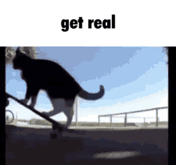

# getreal.c



A command-line tool written in C for decrypting/encrypting patterns in
S3M files, as seen in the music files for the 1993 demo Second Reality:
* [MUSIC0.S3M](https://github.com/mtuomi/SecondReality/raw/master/MAIN/MUSIC0.S3M)
* [MUSIC1.S3M](https://github.com/mtuomi/SecondReality/raw/master/MAIN/MUSIC1.S3M)

To compile on Linux, or some other decent OS, run `make.sh`.

To compile on Windows, idk good luck with that.

Usage example:

```bash
getreal file1.s3m file2.s3m file3.s3m
```

You can specify as many files as you want, and each one will be decrypted
or encrypted depending on whether it is already encrypted or decrypted.

The algorithm is the same both ways, so regular files will be encrypted, and
encrypted files will be decrypted.

Exit codes:

* 0: success for all files
* 1: error - no files specified
* 2: error - unable to read/write to at least one file
* 4: error - at least one file is not a valid S3M file
* 8: error - at least one file caused an attempt to be read out of bounds

Combinations of 2, 4, and 8 will be added together if they occur simultaneously.
